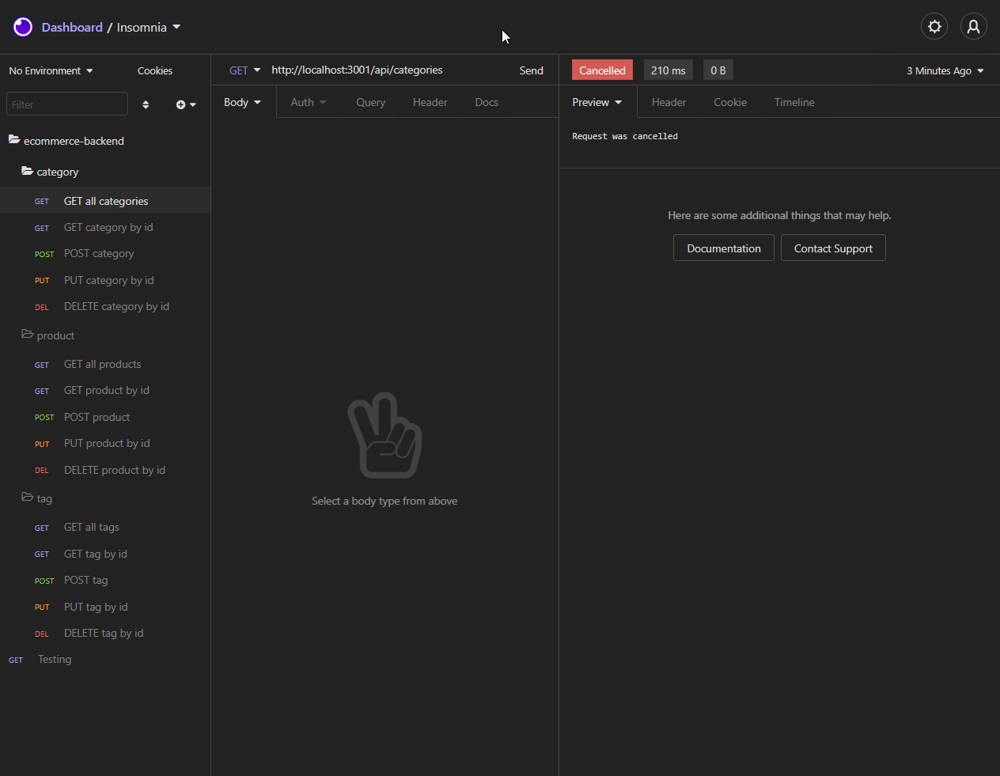
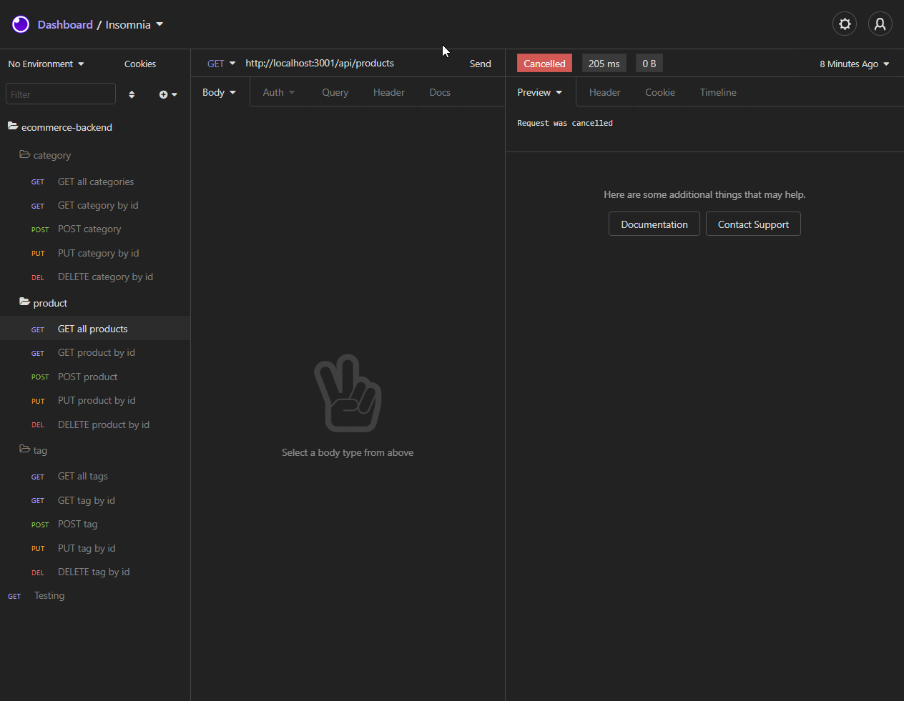
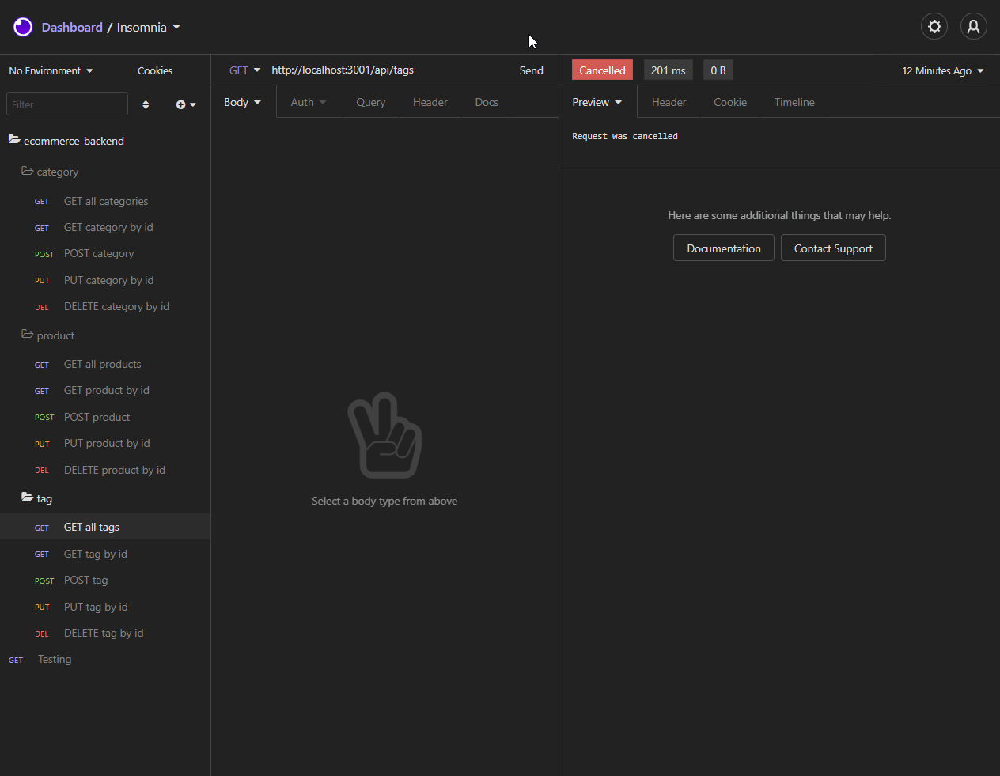

# **E-Commerce Back End APIs**
 &emsp;&emsp;

&nbsp;
## **Table of Contents**
  - [**Description**](#description)
  - [**Video Demonstration**](#video-demonstration)
  - [**Development/Application Screenshots**](#developmentapplication-screenshots)
  - [**Technologies and Services**](#technologies-and-services)
  - [**License**](#license)

&nbsp;
## **Description**
E-commerce backend is a demonstration of building out a set of RESTful APIs to mock functionality of a online shopping site back end. The server application is connected to a MySQL database that contains four tables which includes 1 one-to-many relation and 1 many-to-many relation. Sequelize is used as an ORM to facilitate model (table) definitions and to perform SQL query operations on the database. The Sequelize database operations are initiated by submitting a get, push, put, or delete request to the appropriate API routes.  

This demo server application is built with JavaScript and Express.js. The capabilities of the app can be tested using an API testing client such as [Postman](https://www.postman.com/) or [Insomnia](https://insomnia.rest/). 

&nbsp;
## **[Video Demonstration](https://youtu.be/zaWdTV4h6FY)**
&nbsp;
## **Development/Application Screenshots**

&nbsp;
## **Technologies and Services**
Development Technologies
- Node.js, Express
- MySQL, Prisma 

External Packages, Frameworks, and Services
- [express](https://www.npmjs.com/package/express)
- [prisma](https://www.prisma.io/)

&nbsp;
## **License**
Licensed under the [MIT](./LICENSE) license.